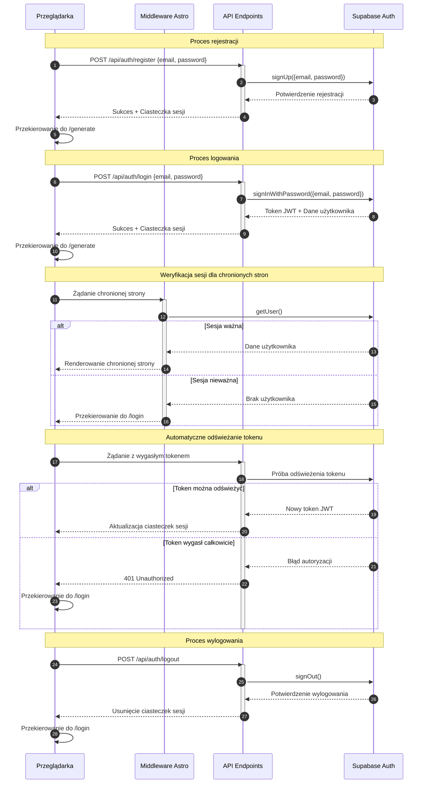

```mermaid
sequenceDiagram
    autonumber
    participant Browser as Przeglądarka
    participant Middleware as Middleware Astro
    participant API as API Endpoints
    participant Auth as Supabase Auth

    %% Rejestracja użytkownika
    Note over Browser,Auth: Proces rejestracji
    Browser->>API: POST /api/auth/register {email, password}
    activate API
    API->>Auth: signUp({email, password})
    Auth-->>API: Potwierdzenie rejestracji
    API-->>Browser: Sukces + Ciasteczka sesji
    deactivate API
    Browser->>Browser: Przekierowanie do /generate

    %% Logowanie użytkownika
    Note over Browser,Auth: Proces logowania
    Browser->>API: POST /api/auth/login {email, password}
    activate API
    API->>Auth: signInWithPassword({email, password})
    Auth-->>API: Token JWT + Dane użytkownika
    API-->>Browser: Sukces + Ciasteczka sesji
    deactivate API
    Browser->>Browser: Przekierowanie do /generate

    %% Weryfikacja sesji
    Note over Browser,Auth: Weryfikacja sesji dla chronionych stron
    Browser->>Middleware: Żądanie chronionej strony
    activate Middleware
    Middleware->>Auth: getUser()

    alt Sesja ważna
        Auth-->>Middleware: Dane użytkownika
        Middleware-->>Browser: Renderowanie chronionej strony
    else Sesja nieważna
        Auth-->>Middleware: Brak użytkownika
        Middleware-->>Browser: Przekierowanie do /login
    end
    deactivate Middleware

    %% Odświeżanie tokenu
    Note over Browser,Auth: Automatyczne odświeżanie tokenu
    Browser->>API: Żądanie z wygasłym tokenem
    activate API
    API->>Auth: Próba odświeżenia tokenu

    alt Token można odświeżyć
        Auth-->>API: Nowy token JWT
        API-->>Browser: Aktualizacja ciasteczek sesji
    else Token wygasł całkowicie
        Auth-->>API: Błąd autoryzacji
        API-->>Browser: 401 Unauthorized
        Browser->>Browser: Przekierowanie do /login
    end
    deactivate API

    %% Wylogowanie
    Note over Browser,Auth: Proces wylogowania
    Browser->>API: POST /api/auth/logout
    activate API
    API->>Auth: signOut()
    Auth-->>API: Potwierdzenie wylogowania
    API-->>Browser: Usunięcie ciasteczek sesji
    deactivate API
    Browser->>Browser: Przekierowanie do /login
```
