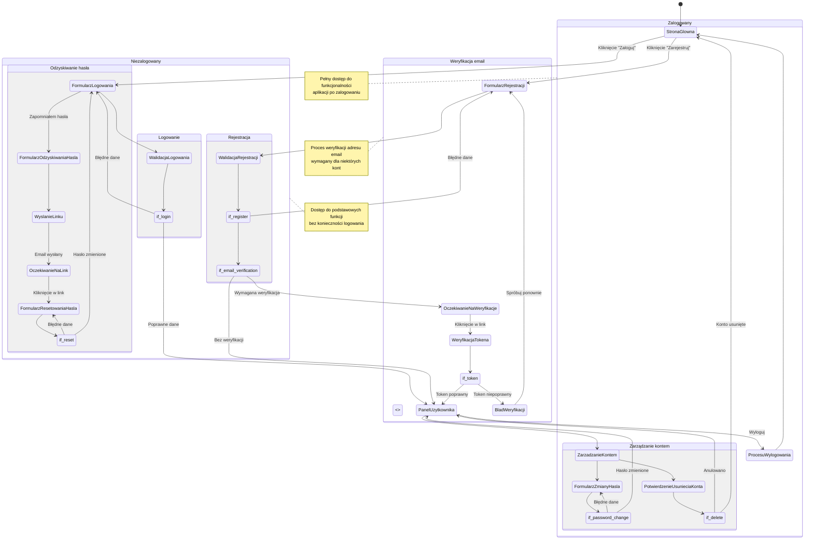

```mermaid
stateDiagram-v2
    [*] --> StronaGlowna

    state "Niezalogowany" as Guest {
        StronaGlowna --> FormularzLogowania: Kliknięcie "Zaloguj"
        StronaGlowna --> FormularzRejestracji: Kliknięcie "Zarejestruj"

        state "Logowanie" as Login {
            FormularzLogowania --> WalidacjaLogowania
            WalidacjaLogowania --> if_login <<choice>>
            if_login --> FormularzLogowania: Błędne dane
            if_login --> PanelUzytkownika: Poprawne dane
            FormularzLogowania --> FormularzOdzyskiwaniaHasla: Zapomniałem hasła
        }

        state "Rejestracja" as Register {
            FormularzRejestracji --> WalidacjaRejestracji
            WalidacjaRejestracji --> if_register <<choice>>
            if_register --> FormularzRejestracji: Błędne dane
            if_register --> if_email_verification <<choice>>
            if_email_verification --> OczekiwanieNaWeryfikacje: Wymagana weryfikacja
            if_email_verification --> PanelUzytkownika: Bez weryfikacji
        }

        state "Odzyskiwanie hasła" as PasswordReset {
            FormularzOdzyskiwaniaHasla --> WyslanieLinku
            WyslanieLinku --> OczekiwanieNaLink: Email wysłany
            OczekiwanieNaLink --> FormularzResetowaniaHasla: Kliknięcie w link
            FormularzResetowaniaHasla --> if_reset <<choice>>
            if_reset --> FormularzResetowaniaHasla: Błędne dane
            if_reset --> FormularzLogowania: Hasło zmienione
        }
    }

    state "Zalogowany" as Auth {
        PanelUzytkownika --> ZarzadzanieKontem

        state "Zarządzanie kontem" as AccountManagement {
            ZarzadzanieKontem --> FormularzZmianyHasla
            ZarzadzanieKontem --> PotwierdzenieUsunieciaKonta

            FormularzZmianyHasla --> if_password_change <<choice>>
            if_password_change --> FormularzZmianyHasla: Błędne dane
            if_password_change --> PanelUzytkownika: Hasło zmienione

            PotwierdzenieUsunieciaKonta --> if_delete <<choice>>
            if_delete --> PanelUzytkownika: Anulowano
            if_delete --> StronaGlowna: Konto usunięte
        }

        PanelUzytkownika --> ProcesuWylogowania: Wyloguj
        ProcesuWylogowania --> StronaGlowna
    }

    state "Weryfikacja email" as EmailVerification {
        OczekiwanieNaWeryfikacje --> WeryfikacjaTokena: Kliknięcie w link
        WeryfikacjaTokena --> if_token <<choice>>
        if_token --> PanelUzytkownika: Token poprawny
        if_token --> BladWeryfikacji: Token niepoprawny
        BladWeryfikacji --> FormularzRejestracji: Spróbuj ponownie
    }

    note right of Guest
        Dostęp do podstawowych funkcji
        bez konieczności logowania
    end note

    note right of Auth
        Pełny dostęp do funkcjonalności
        aplikacji po zalogowaniu
    end note

    note right of EmailVerification
        Proces weryfikacji adresu email
        wymagany dla niektórych kont
    end note
```
