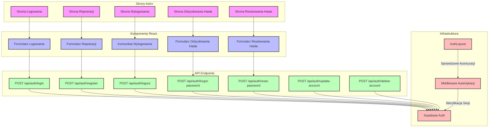

# Diagram architektury UI dla modułu autentykacji

<architecture_analysis>

1. Komponenty wymienione w dokumentacji i znalezione w codebase:

Strony Astro:
- `/login` - strona logowania
- `/register` - strona rejestracji
- `/forgot-password` - strona odzyskiwania hasła
- `/reset-password` - strona resetowania hasła
- `/logout` - strona wylogowania

Komponenty React:
- `LoginForm` - formularz logowania
- `RegisterForm` - formularz rejestracji
- `ForgotPasswordForm` - formularz odzyskiwania hasła
- `ResetPasswordForm` - formularz resetowania hasła
- `LogoutMessage` - komunikat potwierdzający wylogowanie

Layout:
- `AuthLayout.astro` - dedykowany layout dla widoków wymagających autentykacji

API Endpoints:
- `/api/auth/register` - rejestracja użytkownika
- `/api/auth/login` - logowanie
- `/api/auth/logout` - wylogowywanie
- `/api/auth/forgot-password` - wysyłanie linku do odzyskiwania hasła
- `/api/auth/reset-password` - resetowanie hasła
- `/api/auth/update-account` - aktualizacja danych użytkownika
- `/api/auth/delete-account` - usuwanie konta

2. Główne strony i ich komponenty:
- Strona logowania -> LoginForm
- Strona rejestracji -> RegisterForm
- Strona odzyskiwania hasła -> ForgotPasswordForm
- Strona resetowania hasła -> ResetPasswordForm
- Strona wylogowania -> LogoutMessage

3. Przepływ danych:
- Komponenty React -> API Endpoints -> Supabase Auth
- Middleware weryfikuje sesję dla chronionych stron
- Strony Astro wykorzystują SSR do renderowania na podstawie stanu autentykacji
- Strona wylogowania komunikuje się z API przez LogoutMessage

4. Funkcjonalność komponentów:
- Formularze React: walidacja, obsługa błędów, komunikacja z API
- Strony Astro: routing i renderowanie server-side
- AuthLayout: zarządzanie layoutem dla zalogowanych użytkowników
- Middleware: weryfikacja sesji i przekierowania
- API Endpoints: obsługa żądań autentykacji i komunikacja z Supabase
- LogoutMessage: obsługa procesu wylogowania i wyświetlanie komunikatu potwierdzającego

</architecture_analysis>

